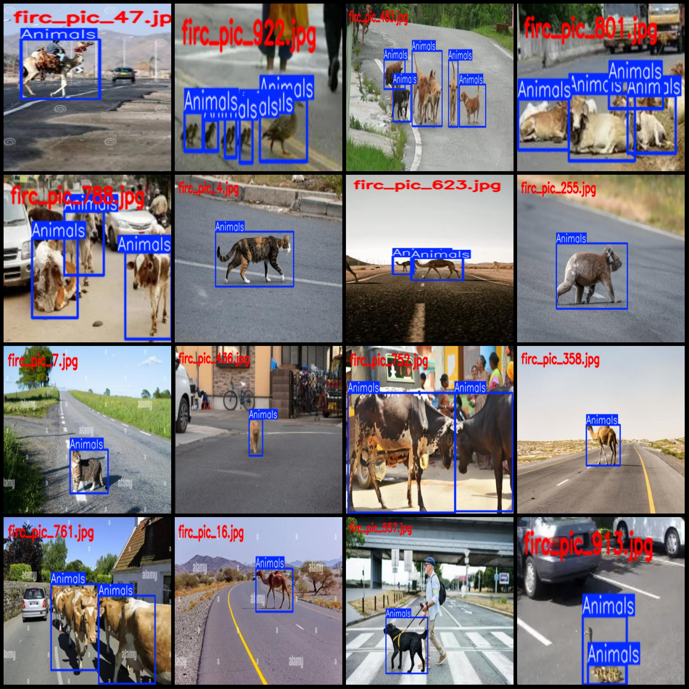
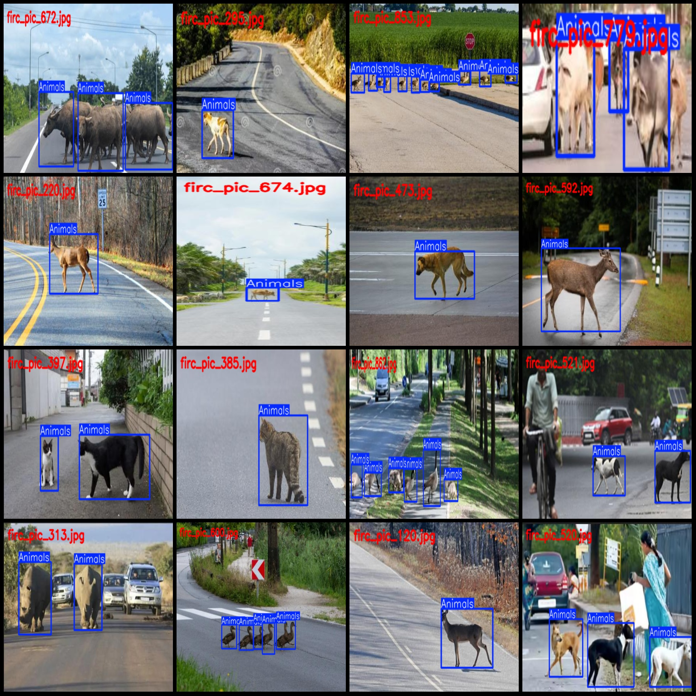

# Road Animal Crossing Detection Dataset VOC+YOLO Format with 969 Images in 1 Category

Dataset format: Pascal VOC format + YOLO format (txt file without split paths, only containing jpg images along with corresponding VOC format xml files and yolo format txt files)
Number of images (jpg file count): 969
Number of annotations (xml file count): 969
Number of annotations (txt file count): 969
Number of categories: 1
Annotation category name: ["Animals"]
Number of bounding box instances per category:
Animals = 2372
Total number of bounding boxes: 2372
Number of images per category:
Animals = 969
Image resolution: Multi-resolution images, such as 449x296, 446x281, etc.
Annotation tool used: labelImg
Annotation rules: Draw bounding boxes for the category
Important note: The dataset does not have a training/validation/test split, so it needs to be divided by the user.
Special declaration: This dataset does not guarantee the accuracy of the trained models or weight files.
Image preview:
Annotation example:

## Images

Here is a pay link on Stripe ( https://buy.stripe.com/3cs8yP7sY87d0vu9AB ). Please contact me lonlonago@foxmail.com after funding $89, and I will send you a complete data files , thank you!

